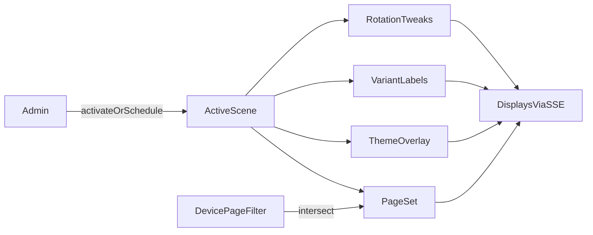

# Scene Modes - Plan

## Goal Capsule

- **Objective:** Let a household admin switch the whole wall dashboard into a named context (Morning, Print watch, Night ambient) in one action, instead of retuning pages, theme, variants, and rotation separately.
- **Product authority:** Open-Dash remains a glanceable LAN kiosk with live admin config — scenes compose existing primitives; they do not replace the page canvas or become a Home Assistant control surface.
- **Open blockers:** None that block planning. Event-driven activation (e.g. print started) is deferred, not unresolved for v1.

## Product Contract

### Summary

Ship **Scene modes**: named presets that, when activated, apply a coherent overlay — which pages participate in rotation, theme mode/accent, active widget variant labels, and optional rotation timing — live to every display via the existing config + SSE path. Manual activation and optional time schedules ship in v1; external/event triggers do not.

### Problem Frame

Today the admin already has pages, page schedules, device page filters, theme, rotation, and widget variants — but they are independent knobs. A “print is running, show the printer page and dim the rest” moment requires several edits and is easy to leave half-applied. Adjacent wall products treat dual-mode / day-night switching as table stakes ([Magic Frame](https://magicframe.dev/), HA day/night navigate patterns), while Open-Dash’s strength is composing its existing spine without becoming HA.

### Key Decisions

- **Compose, don’t fork.** Scenes overlay the shared config document; they are not a second parallel config store or a per-display private layout editor.
- **One active scene (or none).** `none` preserves today’s unconstrained behavior (all schedules/device filters as today). Activating a scene replaces the previous scene’s overlay.
- **Manual + schedule in v1.** Admin one-click activate is required. Optional scene schedule (same day/time semantics as page/widget schedules) may auto-activate. OctoPrint/HA/webhook event activation is deferred.
- **Device page filters still apply.** A scene’s page set is intersected with each display’s device `pages` preference (`[]` = all). Scenes do not override per-device scale.
- **Variants selected by label.** A scene names a variant label; widgets that define that label become active; widgets without it keep their current/default variant behavior.

### Actors

- A1. Household admin — configures and activates scenes from the admin UI on the trusted LAN.
- A2. Wall-display viewers — glance only; do not configure scenes.
- A3. Dashboard displays — apply the active scene live when config changes (SSE), without a full browser reload.

### Key Flows

- F1. Manual activate
  - **Trigger:** Admin selects a scene and activates it.
  - **Actors:** A1, A3
  - **Steps:** Admin saves/activates; config version bumps; displays receive live update; page set, theme, variants, and rotation overlay apply.
  - **Outcome:** All connected displays show the scene context within one live-reload cycle.
  - **Covered by:** R1, R2, R3, R4, R5, R8

- F2. Schedule auto-activate
  - **Trigger:** Clock enters a scene’s enabled schedule window (and that scene is the highest-priority matching schedule if multiple overlap — see Outstanding Questions).
  - **Actors:** A3 (system applies), A1 (configured earlier)
  - **Steps:** Runtime evaluates scene schedules; matching scene becomes active; same apply path as F1.
  - **Outcome:** Morning/Night contexts flip without admin presence.
  - **Covered by:** R6, R7

- F3. Clear scene
  - **Trigger:** Admin clears active scene (or activates “None”).
  - **Actors:** A1, A3
  - **Steps:** Active scene unset; overlays removed; underlying pages/schedules/theme/variants resume normal behavior.
  - **Outcome:** Dashboard returns to pre-scene baseline without deleting scene definitions.
  - **Covered by:** R5, R9

### Requirements

**Scene definition**

- R1. An admin can create, rename, and delete named scenes in the shared dashboard config without leaving the admin UI.
- R2. A scene can declare an ordered or unordered set of page ids that participate while the scene is active; pages outside that set are skipped by rotation for the duration of the scene.
- R3. A scene can optionally override theme mode and/or accent for the duration of the scene.
- R4. A scene can optionally name a widget variant label; while active, widgets that define that label use it via the existing variant merge behavior.

**Activation**

- R5. An admin can manually set the active scene (including none) and every connected display applies it live without a browser refresh.
- R6. A scene may carry an optional schedule (same day + HH:MM window semantics as existing page/widget schedules) that auto-activates it when the window is entered.
- R7. At most one scene is active at a time.

**Compatibility**

- R8. Each display’s device page filter continues to restrict which of the scene’s pages that display shows.
- R9. Clearing the active scene restores baseline theme, variant selection, and page participation without deleting scene definitions.
- R10. Existing configs with no scenes section keep current behavior (active scene = none).

### Acceptance Examples

- AE1. Covers R2, R5, R8.
  - **Given:** Scenes “Print watch” lists only the OctoPrint page; living-room device filter is empty (all pages); kitchen device filter excludes that page.
  - **When:** Admin activates “Print watch”.
  - **Then:** Living-room shows only the OctoPrint page; kitchen shows no pages from the scene (empty/fallback per existing empty-visible behavior — planning must not invent a new empty-state product).

- AE2. Covers R3, R4, R5, R9.
  - **Given:** A weather widget has variants labeled `day` and `night`; scene “Night ambient” sets theme mode dark + accent muted and variant label `night`.
  - **When:** Admin activates then clears the scene.
  - **Then:** While active, theme and `night` variant apply; after clear, prior theme and variant selection return.

- AE3. Covers R6, R7.
  - **Given:** Scene “Morning” schedules weekdays 06:00–09:00.
  - **When:** The clock enters that window with no manual override in effect.
  - **Then:** “Morning” becomes the sole active scene without an admin click.

### Scope Boundaries

**In scope (v1)**

- Scene CRUD in admin; active scene; page set; theme overlay; variant label; optional schedule; live apply; migration-safe absence.

**Deferred for later**

- Event-driven activation (OctoPrint print started, webhooks, MQTT/HA).
- Per-display scene overrides (different active scene per device).
- Glance/declutter layout mode as a scene property.
- Alert routing bundled into scenes.

**Outside this product’s identity**

- Becoming a Home Assistant dashboard or replacing HA scenes/scripts.
- Voice configuration or zero-admin setup.

### Dependencies / Assumptions

- Assumes the single versioned `PUT /api/config` write path and SSE live-reload remain the apply mechanism.
- Assumes `effectiveSettings` variant merge in `web/js/widgets/dom.js` is the correct runtime hook for variant label activation.
- Assumes intersecting scene page set with device `pages` is the correct multi-display rule (confirmed by Key Decision).

### Outstanding Questions

**Deferred to Planning**

- Exact empty-visible UX when a scene + device filter yields zero pages (reuse today’s behavior).
- Priority rule when two scene schedules overlap (last-wins vs explicit priority field).
- Whether manual activation suppresses schedule changes until cleared or until the next schedule boundary.

### Sources / Research

- Ideation: [`docs/ideation/2026-07-17-open-dash-feature-ideas.md`](../ideation/2026-07-17-open-dash-feature-ideas.md)
- Grounding: `server/shared/schema.py` (Page, Schedule, Variant, Theme, PageRotation); `server/shared/devices.py` (per-device pages); `web/js/widgets/dom.js` (`effectiveSettings`); `web/js/app.js` (theme + page visibility)
- External: [Magic Frame](https://magicframe.dev/), [Magic Frame v1.1.0](https://github.com/jeremiaa/magic-frame/releases/tag/v1.1.0), [HA day/night navigate](https://community.home-assistant.io/t/show-dashboards-during-the-day/72257)
